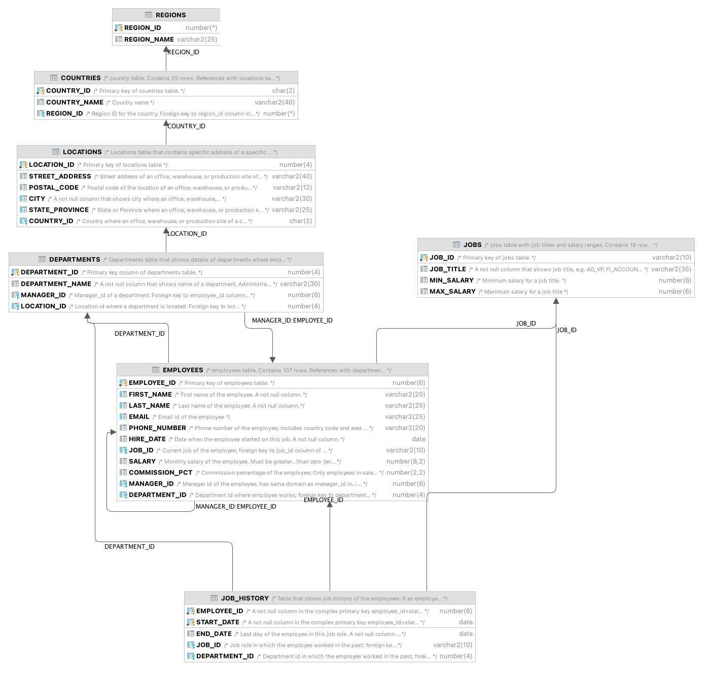

# Spread DIO - Mentoria Oracle
## _Apresentação_
[Apresentação](Banco.pdf) em pdf

## _Instalando o banco de dados Oracle_

Método 1:  VM
 - Pre-Built Developer VMs: Baixar o appliance oracle [Database App Development VM](https://www.oracle.com/downloads/developer-vm/community-downloads.html)
 - Baixar o [Virtual Box](https://www.virtualbox.org)
 - Baixar o [VirtualBox 6.1.30 Oracle VM VirtualBox Extension Pack](https://download.virtualbox.org/virtualbox/6.1.30/Oracle_VM_VirtualBox_Extension_Pack-6.1.30.vbox-extpack)
 
 _Instalar o Virtual Box, depois o Extension pack e [importar](https://www.youtube.com/watch?v=axqiuZ883A8) o appliance para o virtual box

 Método 2: Instalar local
 
 _siga algum dos tutoriais abaixo
  - [Tutorial 1](https://alekciss.com/install-oracle-database-19c-on-windows/)
  - [Tutorial 2](https://www.youtube.com/watch?v=Hnpmy2kB5Mo)

## _IDE de para desenvolvimento_
 - [SQL Developer](https://www.oracle.com/database/technologies/appdev/sqldeveloper-landing.html) (win, mac e linux)(free)
 - [Data Grip](https://www.jetbrains.com/datagrip/?source=google&medium=cpc&campaign=15034927825&gclid=EAIaIQobChMIhv6lju_h9AIVCwaRCh1IJQubEAAYASAAEgK-wvD_BwE)  (win, mac e linux)(trial 30 dias)
 - [PLSQL Developer ](https://www.allroundautomations.com/products/pl-sql-developer/?gclid=EAIaIQobChMI-8GYqe_h9AIVMRXUAR3p5gv_EAAYASAAEgLSNvD_BwE) (win) (trial 30 dias)
 - [DBeaver](https://dbeaver.io) (win, mac e linux)(free)

 ## _Links úteis_
[Entendendo o Quandrante Mágico do Gartner](https://www.sepaforcorporates.com/thoughts/gartner-magic-quadrant-explained-in-about-5-minutes/)
	
[Análise de Desempenho SQL Server x Oracle](http://www.linhadecodigo.com.br/artigo/2412/analise-de-desempenho-entre-os-bancos-de-dados-sql-sever-x-oracle.aspx)

[Funções para Validação de CPF/CNPJ](https://glufke.net/oracle/viewtopic.php?t=2529)

# Modelo de Dados
_MER_

_Script_

- Com o banco já criado, logar com o usuário e executar o script [01_CRIACAO_TABELAS](Tabelas/01_CRIACAO_TABELAS.sql)

- Depois que executar o script de criação, executar o script [02-CARGA-DADOS](Tabelas/02-CARGA-DADOS.sql)

- Caso queira, execute também o script [03-CARGA_DADOS-OPCIONAL](Tabelas/03-CARGA_DADOS-OPCIONAL.sql)

Agora já temos o ambiente montado e os dados carregados é so usar os scripts da pasta [Scripts](Scripts)

